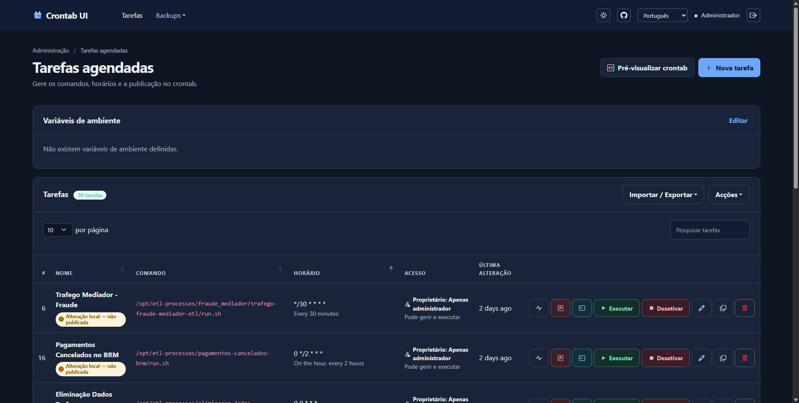
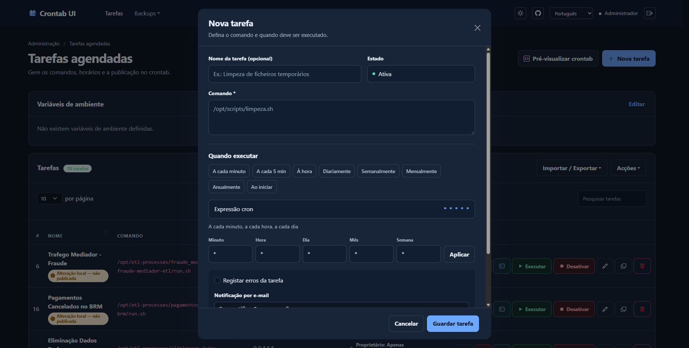
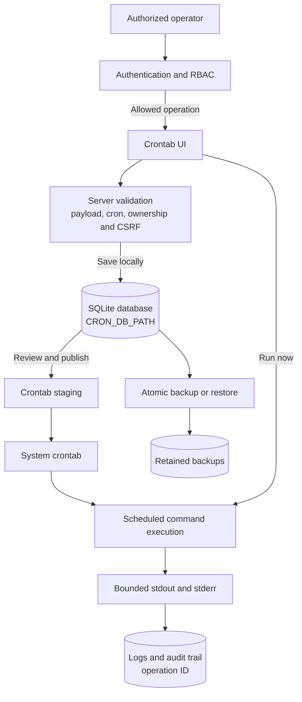

# Crontab UI

[English](README.md) | [Português (Portugal)](README.pt-PT.md)

<p align="center"></p>

Web-based cron job management with access controls, backups, auditing, and execution limits.

> Running a task is equivalent to running its command with the service process's privileges. Deploy the application only in environments where authorized administrators may create and publish those commands.

## What's new in this fork

This fork extends the original visual crontab management interface with production-oriented operational controls:

- Role-based access control (RBAC), task ownership, and server-enforced permissions for administrative operations.
- Strict validation for task payloads, cron expressions, environment variables, imports, and recovery requests.
- Server-only SMTP profiles: task records store only a `profileId`, never mail credentials.
- Atomic, mutex-protected import, restore, and backup workflows with count- and age-based retention.
- Bounded command execution with timeouts, output limits, termination handling, structured audit events, correlation IDs, and log rotation.
- Production deployment safeguards, including mandatory authentication outside loopback, CSRF protection, TLS or trusted-proxy enforcement, and hardened Docker guidance.

## Interface

### Task overview



### Create a task



## Operational flow



Tasks are saved locally first. They affect the system scheduler only after an authorized operator explicitly reviews and publishes them.

## Canonical source and releases

The canonical source for this fork is [Kowts/crontab-ui](https://github.com/Kowts/crontab-ui). The remote currently has no published tags: do not replace `<release-tag>` with a version inferred only from `package.json`. For production, approve a commit after validation, create an annotated tag, and publish a release; the `main` branch is intended for ongoing development and validation.

Do not use `npm install -g crontab-ui` to install this fork: that name may resolve to a different package and does not guarantee the security controls documented here.

### Upstream reference

[The original upstream README](README/README.ORIGINAL.md) is retained for historical comparison only. It contains outdated setup and deployment instructions that do not provide this fork's security controls; use this README and the operational guides in this repository instead.

## Platform requirements and limitations

- Node.js 20 or later;
- Linux/Unix with the `crontab` executable available to import from or publish to the system crontab;
- write permissions only for the data directory and the scheduling mechanism managed by the service;
- native TLS or a trusted HTTPS reverse proxy for production.

The interface and tests can run on Windows, but **Get from crontab** and **Publish to crontab** require `crontab` and are not natively supported by that operating system.

## Installation from the repository

For development or to prepare a release candidate:

```bash
git clone https://github.com/Kowts/crontab-ui.git
cd crontab-ui
git checkout <approved-commit-or-published-tag>
npm ci
npm run lint
npm test
```

Before starting, configure variables in the secret manager or process environment. The project does **not** load `.env` automatically. Always set a persistent `CRON_DB_PATH` that only the service user can access.

```bash
export NODE_ENV=production
export HOST=127.0.0.1
export PORT=8000
export CRON_DB_PATH=/var/lib/crontab-ui
export BASIC_AUTH_USERS_JSON='{"admin":"replace-with-a-secret"}'
export AUTHZ_ROLE_MAP_JSON='{"admin":"admin"}'
export CSRF_SECRET='replace-with-a-long-random-secret'
export TRUSTED_PROXY='127.0.0.1'
npm start
```

This example assumes that a local HTTPS proxy terminates TLS and is the only source that connects to the service. See the [Nginx configuration](README/nginx.md) for the `X-Forwarded-Proto` header and `TRUSTED_PROXY` value.

## Docker Compose deployment

`docker-compose.yml` does not expose the application port and passes `NODE_ENV=production`, `HOST=0.0.0.0`, `BASIC_AUTH_USERS_JSON`, `AUTHZ_ROLE_MAP_JSON`, `CSRF_SECRET`, and `TRUSTED_PROXY` to the container. The image is locally tagged as `kowts/crontab-ui`. It declares the shared `crontab-ui-internal` network, whose name can be changed with `CRONTAB_UI_NETWORK`; the proxy Compose project must reference it as an external network. The repository does not include an Nginx service, so the proxy remains separately managed. Copy the following values into a secret file, such as `.env.production`, which **must not** be committed:

```dotenv
# Use this scheme only when configuring multiple users.
BASIC_AUTH_USERS_JSON={"admin":"replace-with-a-secret","operator":"replace-with-another-secret"}
AUTHZ_ROLE_MAP_JSON={"admin":"admin","operator":"operator"}
CSRF_SECRET=replace-with-a-long-random-secret
CRONTAB_UI_NETWORK=crontab-ui-internal
# Illustrative example: confirm the effective network before using this value.
# It must identify the direct proxy source that forwards traffic to the container.
TRUSTED_PROXY=172.20.0.0/16
```

Validate values without exposing them in the terminal, then start the service:

```bash
docker compose --env-file .env.production up -d --build
docker compose ps
```

For local development, the overlay exposes the port on loopback only. This mode does not replace an integration test with the production proxy:

```bash
docker compose --env-file .env.production -f docker-compose.yml -f docker-compose.dev.yml up --build
```

Do not mount the host crontab directory into the container. Use only the managed `crontab-data` volume; mounting the host crontab grants the application control over host scheduling and removes container isolation.

The image runs the web process, `crond`, and scheduled tasks as the unprivileged `node` user. Supervisor remains PID 1 solely to manage those processes. After an image upgrade, verify the effective identity with a disposable task such as `id > /crontab-ui/crontabs/logs/scheduled-identity.txt`, publish it, wait for the schedule, then run:

```bash
docker compose --env-file .env.production exec crontab-ui sh -c 'ps -o user,pid,ppid,args; cat /crontab-ui/crontabs/logs/scheduled-identity.txt'
```

The output for the scheduled task must contain `uid=1000(node)` (or the UID assigned to `node` in the image). Do not treat a healthy HTTP endpoint as evidence of scheduler privilege isolation.

## Authentication and authorization

When `HOST` is not loopback, authentication is mandatory. Two alternatives are available:

- `BASIC_AUTH_USER` and `BASIC_AUTH_PWD` for a single user;
- `BASIC_AUTH_USERS_JSON` for a map of multiple users.

When both are defined, `BASIC_AUTH_USERS_JSON` takes precedence and the single-user pair is ignored. In deployments with authentication, every user must be present in `AUTHZ_ROLE_MAP_JSON`.

| Role | Capabilities |
| --- | --- |
| `viewer` | Read own tasks, previews, exports, and logs. |
| `executor` | Viewer capabilities and execution of own tasks. |
| `operator` | Viewer capabilities and creation, editing, pausing, activation, removal, and execution of own tasks. |
| `admin` | Global access, environment management, import/export, backups, restore, and system crontab import. |

Each created task receives `owner` and `createdBy`. Legacy tasks and tasks imported from the system do not have an owner and remain restricted to administrators until they are recreated or assigned through an administrative process. The interface displays the owner, effective capabilities, and whether a task is only local or published; the server continues to enforce permissions on every endpoint.

## Configuration reference

`.env.example` is a template for names and formats, not a file loaded by the application. Keep secrets in the secret manager or deployment environment.

| Variable | Purpose and default value |
| --- | --- |
| `NODE_ENV` | Use `production` for deployment; enables secure cookies and requires TLS or a trusted proxy. |
| `HOST`, `PORT`, `BASE_URL` | HTTP listener and public prefix. Defaults: `127.0.0.1`, `8000`, no prefix. |
| `CRON_DB_PATH` | Persistent directory for the SQLite database (`crontab.db`), backups, environment, audit log, and execution output. Default: `./crontabs`. |
| `CRON_PATH` | Crontab staging directory. It must be accessible only to the application process and the isolated scheduler. Default: `$CRON_DB_PATH/crontab-staging`. |
| `CRON_USER` | Scheduler account when `CRON_IN_DOCKER` is enabled. The image fixes this to `node`; do not set it to `root`. |
| `BASIC_AUTH_USER`, `BASIC_AUTH_PWD` | Single-user authentication; an alternative to the JSON map. |
| `BASIC_AUTH_USERS_JSON` | JSON map of users and passwords; takes precedence over the single-user pair. |
| `AUTHZ_ROLE_MAP_JSON` | JSON map from user to `viewer`, `executor`, `operator`, or `admin`. |
| `CSRF_SECRET` | Persistent secret required in production. |
| `SSL_CERT`, `SSL_KEY` | Native TLS; both must be defined together. |
| `TRUSTED_PROXY` | Address, CIDR, or Express proxy alias for the trusted HTTPS proxy. |
| `CRONTAB_UI_NETWORK` | Name of the Docker network shared with the proxy. Compose default: `crontab-ui-internal`. |
| `MAIL_PROFILES_JSON` | Server-only SMTP/SMTPS profiles. Tasks retain only `profileId`. |
| `MAIL_MAX_ATTACHMENT_BYTES` | Maximum output attachment size for email. Default: `524288`. |
| `COMMAND_TIMEOUT_MS`, `COMMAND_MAX_BUFFER`, `COMMAND_KILL_GRACE_MS` | Limits for task execution and publishing. Defaults: `300000`, `1048576`, `5000`. |
| `LOG_MAX_BYTES`, `LOG_ROTATION_COUNT`, `LOG_RETENTION_DAYS` | Log size, rotation, and retention. Defaults: `10485760`, `5`, `30`. |
| `BACKUP_RETENTION_COUNT`, `BACKUP_RETENTION_DAYS` | Maximum backup count and age. Defaults: `30`, `90`. |
| `SYSTEM_CRONTAB_IMPORT_TIMEOUT_MS`, `SYSTEM_CRONTAB_IMPORT_MAX_BUFFER` | Limits for `crontab -l` reads. Defaults: `30000`, `262144`. |
| `TASK_ENV_ALLOWLIST` | Comma-separated, reviewed UI-managed variables passed to task processes. Default: `PATH,LANG,LC_ALL,TZ,MAILTO`. Service secrets and unsafe loader variables are always denied. |
| `ENABLE_AUTOSAVE` | Enables automatic publishing after changes; use only after accepting the operational risk. |

`CRON_IN_DOCKER` is an internal Docker-image variable, not a public deployment setting. `ALLOW_INSECURE_NO_AUTH` is not supported in production.

## Email, environment, and command security

Email profiles are defined in `MAIL_PROFILES_JSON` and accept only SMTP/SMTPS `transporter`, `from`, and one to twenty `to` recipients. Credentials never enter the database, tasks, or browser. Transport failures are audited; monitor the operation log.

Environment variables entered through the interface accept only `NAME=value` lines, where names match `^[A-Z_][A-Z0-9_]*$`. Shell syntax (`export`, `$()`, backticks, pipes, redirections, and `;`) is rejected. Task processes receive a fresh environment, not `process.env`: only reviewed names in `TASK_ENV_ALLOWLIST` are passed through. Authentication, CSRF, SMTP, Node loader, and dynamic-loader variables are never passed to commands. This does not make task commands safe: those commands remain a privileged capability and must be reviewed before creation.

Every manual or scheduled execution has a timeout, a combined output limit, and SIGTERM/SIGKILL shutdown. Crontab import and publishing use execution without a shell; importing is bounded, deduplicated, mutex-protected, and responds only after completion. On Linux, the executor terminates the process group; on Windows, complete process-tree termination depends on the operating system.

## Backups, recovery, and audit

Before importing a database or restoring a backup, the application creates a backup and validates the candidate. Database imports default to **Merge**: existing tasks remain, exact duplicates are skipped, and same-name/different-content tasks are reported as conflicts without being overwritten. The review dialog shows the resulting counts before any write. **Replace all existing tasks** is available only as an explicit import mode and is destructive after the automatic backup. Recognized backups follow count- and age-based retention; retention failures are audited.

On first start, a legacy NeDB `crontab.db` is migrated automatically to SQLite. The original file is retained alongside it as `crontab.db.legacy-nedb-<timestamp>`; preserve it until the migrated tasks and a recovery restore have been verified, then remove it using the normal change-management process.

Recovery procedure:

1. Suspend public access at the proxy while preserving the `crontab-data` volume and `crontabs/logs/operations.jsonl`.
2. Identify the `operationId` displayed in the interface or the `X-Request-ID` header and preserve the failure context.
3. Validate the exported copy or candidate backup in an isolated instance.
4. Use only the administrative **Backups** area to restore a recognized backup.
5. Confirm tasks, environment, and preview before publishing to crontab again.

Do not run the service as `root` to bypass permissions and do not use `--reset` as routine recovery: both can invalidate privilege separation or erase the active configuration. Correct volume permissions and restore a validated backup.

`operations.jsonl` contains structured events with actor, role, outcome, duration, and correlation IDs. Commands are recorded as SHA-256 hashes. Export the log to centrally retained storage with restricted access and regularly test restores in a non-production instance.

Arbitrary hooks are not supported. For post-processing, use an explicit, reviewed, and auditable task.

## Release checklist

1. Pin a `Kowts/crontab-ui` release/tag and run `npm ci`.
2. Configure authentication, RBAC, `CSRF_SECRET`, persistent `CRON_DB_PATH`, and native TLS or `TRUSTED_PROXY`.
3. Run `npm run lint`, `npm test`, `npm run test:coverage`, and `npm audit --omit=dev --audit-level=high`.
4. Perform a restore test in an isolated instance and confirm backup and log retention.
5. Build and run the Docker image on the target platform, verifying `crond` compatibility, capabilities, and the persistent volume.

## Resources

- [Nginx and TLS configuration](README/nginx.md)
- [Troubleshooting and recovery](README/issues.md)
- [MIT License](LICENSE.md)
