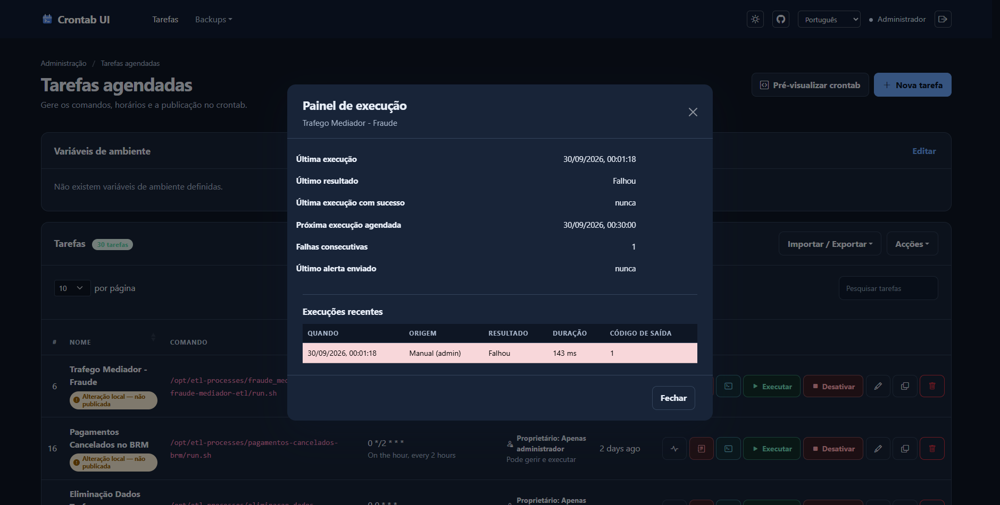
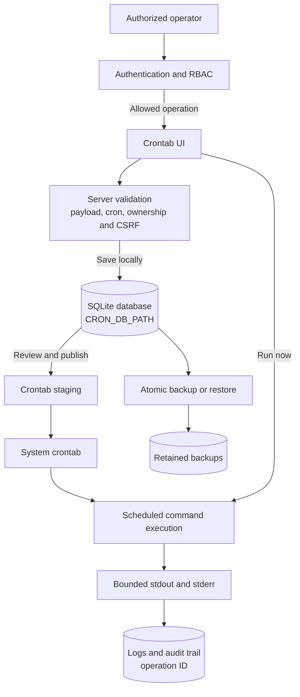

# Crontab UI

[English](README.md) | [Português (Portugal)](README.pt-PT.md)

<p align="center"></p>

Web-based cron job management with access controls, backups, auditing, and execution limits.

> Running a task is equivalent to running its command with the service process's privileges. Deploy the application only in environments where authorized administrators may create and publish those commands.

## What's new in this fork

This fork extends the original visual crontab management interface with production-oriented operational controls:

- Role-based access control (RBAC), task ownership, and server-enforced permissions for administrative operations.
- Strict validation for task payloads, cron expressions, environment variables, imports, and recovery requests.
- Server-only SMTP profiles: task records store only a `profileId` and delivery policy, never mail credentials.
- Per-task failure alerting after N consecutive failures, with a cooldown and a clear-on-success reset, so one bad afternoon does not become a hundred emails and a transient failure does not become an alert.
- A per-task execution panel with retained run history: last run, duration, exit code, last successful run, next scheduled run, and consecutive failures, without opening one log per task.
- Atomic, mutex-protected import, restore, and backup workflows with count- and age-based retention.
- Bounded command execution with timeouts, output limits, termination handling, structured audit events, correlation IDs, and log rotation.
- Persisted manual-run state, with one simultaneous manual execution per actor and clean interruption on service shutdown.
- Password storage as scrypt digests, with a generator, startup validation, and no user enumeration through response timing.
- Production deployment safeguards, including mandatory authentication outside loopback, CSRF protection, TLS or trusted-proxy enforcement, and hardened Docker guidance.

## Interface

### Task overview


### Create a task


### Execution panel

Every row has an execution panel that answers, for one task, when it last ran, how long it took, what it returned, when it last worked, how many failures have stacked up, and when it is next due. Recent executions are listed with their trigger, so a failure can be found without opening one log per task.



## Operational flow



Tasks are saved locally first. They affect the system scheduler only after an authorized operator explicitly reviews and publishes them.

## Canonical source and releases

The canonical source for this fork is [Kowts/crontab-ui](https://github.com/Kowts/crontab-ui). The remote currently has no published tags: do not replace `<release-tag>` with a version inferred only from `package.json`. For production, approve a commit after validation, create an annotated tag, and publish a release; the `main` branch is intended for ongoing development and validation.

Do not use `npm install -g crontab-ui` to install this fork: that name may resolve to a different package and does not guarantee the security controls documented here.

### Upstream reference

[The original upstream README](README/README.ORIGINAL.md) is retained for historical comparison only. It contains outdated setup and deployment instructions that do not provide this fork's security controls; use this README and the operational guides in this repository instead.

## Platform requirements and limitations

- Node.js 20 or later;
- Linux/Unix with the `crontab` executable available to import from or publish to the system crontab;
- write permissions only for the data directory and the scheduling mechanism managed by the service;
- native TLS or a trusted HTTPS reverse proxy for production.

The interface and tests can run on Windows, but **Get from crontab** and **Publish to crontab** require `crontab` and are not natively supported by that operating system.

## Installation from the repository

For development or to prepare a release candidate:

```bash
git clone https://github.com/Kowts/crontab-ui.git
cd crontab-ui
git checkout <approved-commit-or-published-tag>
npm ci
npm run lint
npm test
```

Before starting, configure variables in the secret manager or process environment. Always set a persistent `CRON_DB_PATH` that only the service user can access.

### Loading local environment files

`npm start` deliberately does not load an environment file, preventing local development from accidentally using production credentials or transport settings.

Use `npm run start:env` for `.env`, or `npm run start:production` for `.env.production`. `start:env` requires `.env` to exist.

```bash
export NODE_ENV=production
export HOST=127.0.0.1
export PORT=8000
export CRON_DB_PATH=/var/lib/crontab-ui
export BASIC_AUTH_USERS_JSON='{"admin":"replace-with-a-secret"}'
export AUTHZ_ROLE_MAP_JSON='{"admin":"admin"}'
export CSRF_SECRET='replace-with-a-long-random-secret'
export TRUSTED_PROXY='127.0.0.1'
npm start
```

This example assumes that a local HTTPS proxy terminates TLS and is the only source that connects to the service. See the [Nginx configuration](README/nginx.md) for the `X-Forwarded-Proto` header and `TRUSTED_PROXY` value.

### Explicit HTTP exception in production

For an approved, isolated internal deployment, keep production mode and explicitly opt in to HTTP in `.env.production`:

```dotenv
NODE_ENV=production
HOST=127.0.0.1
PORT=8509
ALLOW_HTTP=true
```

Leave `TRUSTED_PROXY`, `SSL_CERT`, and `SSL_KEY` unset for direct HTTP; do not claim that an HTTPS proxy exists. Start with `npm run start:production`. With this host, the service is reachable only from the same computer at `http://127.0.0.1:8509`.

Only the exact value `true` enables this exception. It permits HTTP at startup and per request, removes the `Secure` requirement from session and CSRF cookies, and disables HSTS and CSP HTTPS upgrades. Authentication, RBAC, CSRF validation, and the required production `CSRF_SECRET` remain unchanged. **HTTP provides no encryption: credentials, session cookies, and task data can be intercepted or modified in transit.** Do not expose this mode to public or untrusted networks. Previously cached HSTS may still force HTTPS in a browser until it expires or is cleared. Remove the exception and restart when TLS becomes available.

## Docker Compose deployment

`docker-compose.yml` does not expose the application port and passes `NODE_ENV=production`, `HOST=0.0.0.0`, `BASIC_AUTH_USERS_JSON`, `AUTHZ_ROLE_MAP_JSON`, `CSRF_SECRET`, and `TRUSTED_PROXY` to the container. The image is locally tagged as `kowts/crontab-ui`. It declares the shared `crontab-ui-internal` network, whose name can be changed with `CRONTAB_UI_NETWORK`; the proxy Compose project must reference it as an external network. The repository does not include an Nginx service, so the proxy remains separately managed. Copy the following values into a secret file, such as `.env.production`, which **must not** be committed:

```dotenv
# Use this scheme only when configuring multiple users.
BASIC_AUTH_USERS_JSON={"admin":"replace-with-a-secret","operator":"replace-with-another-secret"}
AUTHZ_ROLE_MAP_JSON={"admin":"admin","operator":"operator"}
CSRF_SECRET=replace-with-a-long-random-secret
CRONTAB_UI_NETWORK=crontab-ui-internal
# Illustrative example: confirm the effective network before using this value.
# It must identify the direct proxy source that forwards traffic to the container.
TRUSTED_PROXY=172.20.0.0/16
```

Validate values without exposing them in the terminal, then start the service:

```bash
docker compose --env-file .env.production up -d --build
docker compose ps
```

For local development, the overlay exposes the port on loopback only. This mode does not replace an integration test with the production proxy:

```bash
docker compose --env-file .env.production -f docker-compose.yml -f docker-compose.dev.yml up --build
```

Do not mount the host crontab directory into the container. Use only the managed `crontab-data` volume; mounting the host crontab grants the application control over host scheduling and removes container isolation.

The image runs the web process, the container scheduler, and scheduled tasks as the unprivileged `node` user. The container-specific scheduler is Supercronic, which watches the staged crontab file and reloads it after publication. Supervisor remains PID 1 solely to manage those processes. After an image upgrade, verify the effective identity with a disposable task such as `id > /crontab-ui/crontabs/logs/scheduled-identity.txt`, publish it, wait for the schedule, then run:

```bash
docker compose --env-file .env.production exec crontab-ui sh -c 'ps -o user,pid,ppid,args; cat /crontab-ui/crontabs/logs/scheduled-identity.txt'
```

The output for the scheduled task must contain `uid=1000(node)` (or the UID assigned to `node` in the image). Do not treat a healthy HTTP endpoint as evidence of scheduler privilege isolation.

Compose drops every Linux capability, then adds only `SETUID` and `SETGID` so Supervisor can start its fixed web and scheduler commands as `node`. Those capabilities are not retained by the child processes or made available to scheduled tasks.

## Authentication and authorization

When `HOST` is not loopback, authentication is mandatory. The web interface uses a secure, signed `HttpOnly` session cookie, so users can sign out from the navigation bar. Two credential configuration alternatives are available:

- `BASIC_AUTH_USER` and `BASIC_AUTH_PWD` for a single user;
- `BASIC_AUTH_USERS_JSON` for a map of multiple users.

When both are defined, `BASIC_AUTH_USERS_JSON` takes precedence and the single-user pair is ignored. In deployments with authentication, every user must be present in `AUTHZ_ROLE_MAP_JSON`. `AUTH_SESSION_SECRET` is optional; when omitted, `CSRF_SECRET` signs the session cookie. Set a dedicated `AUTH_SESSION_SECRET` to rotate session signing independently.

The session cookie is signed and backed by a server-side record, so it can be withdrawn. Signing out removes the record: a copy of the cookie taken beforehand stops being accepted immediately rather than working until it expires. A request whose session record cannot be read is refused rather than falling back to trusting the signature alone. Because the record is the authority, a service restarted with a fresh `AUTH_SESSION_SECRET` also invalidates everything outstanding, and changing an account's password should be accompanied by revoking that account's sessions. Sign-in and sign-out are recorded in the operation log.

### Storing passwords

A password value in `BASIC_AUTH_USERS_JSON` is compared as written, so a literal password is readable by anything that can read the process environment, including `docker inspect` and a committed `.env`. For a real deployment, store a digest instead:

```bash
npx crontab-ui-hash
BASIC_AUTH_USERS_JSON={"admin":"scrypt:5dcf990b...:d3012ee7..."}
```

The digest is `scrypt:<salt>:<hash>`, with a per-user random salt. Literal passwords remain supported and are still compared in constant time, which is acceptable only for loopback development. A value beginning with `scrypt:` that is not a well formed digest stops the service from starting, naming the user, rather than silently leaving the account unable to sign in. A digest from another tool, such as bcrypt or Argon2, is rejected at startup for the same reason. Sign-in performs the same work for an unknown user as for a wrong password, so response time does not disclose which accounts exist. Changing a user password means storing a new digest; there is no way to recover the password from the stored value. See [`docs/passwords.md`](docs/passwords.md) for the full procedure, deployment notes, and troubleshooting.

| Role | Capabilities |
| --- | --- |
| `viewer` | Read own tasks and their logs. Global crontab preview, database export, backups, restore, and environment access are admin-only. |
| `executor` | Viewer capabilities and execution of own tasks. |
| `operator` | Viewer capabilities by default. Creation, editing, pausing, activation, removal, and execution of own tasks require explicit `ALLOW_OPERATOR_TASK_EXECUTION=true`. |
| `admin` | Global access, environment management, import/export, backups, restore, and system crontab import. |

Each created task receives `owner` and `createdBy`. Legacy tasks and tasks imported from the system do not have an owner and remain restricted to administrators until they are recreated or assigned through an administrative process. The interface displays the owner, effective capabilities, and whether a task is only local or published; the server continues to enforce permissions on every endpoint.

## Configuration reference

`.env.example` is a template for names and formats, not a file loaded by the application. Keep secrets in the secret manager or deployment environment.

| Variable | Purpose and default value |
| --- | --- |
| `NODE_ENV` | Use `production` for deployment; enables secure cookies and requires TLS or a trusted proxy. |
| `HOST`, `PORT`, `BASE_URL` | HTTP listener and public prefix. Defaults: `127.0.0.1`, `8000`, no prefix. |
| `CRON_DB_PATH` | Persistent directory for the SQLite database (`crontab.db`), backups, environment, audit log, and execution output. Default: `./crontabs`. |
| `CRON_PATH` | Crontab staging directory. It must be accessible only to the application process and the isolated scheduler. Default: `$CRON_DB_PATH/crontab-staging`. |
| `CRON_USER` | Scheduler account when `CRON_IN_DOCKER` is enabled. The image fixes this to `node`; do not set it to `root`. |
| `SCHEDULER_RELOAD_TIMEOUT_MS` | Maximum wait for Supercronic to validate and acknowledge a published Docker schedule. Default: `10000`. |
| `BASIC_AUTH_USER`, `BASIC_AUTH_PWD` | Single-user authentication; an alternative to the JSON map. |
| `BASIC_AUTH_USERS_JSON` | JSON map of users and passwords; takes precedence over the single-user pair. A value may be a scrypt digest, see below. |
| `AUTHZ_ROLE_MAP_JSON` | JSON map from user to `viewer`, `executor`, `operator`, or `admin`. |
| `CSRF_SECRET` | Persistent secret required in production. |
| `AUTH_SESSION_SECRET` | Optional persistent session-signing secret; defaults to `CSRF_SECRET`. |
| `AUTH_SESSION_TTL_MS` | Session lifetime in milliseconds; defaults to 8 hours (minimum 1 minute, maximum 7 days). |
| `LOGIN_RATE_LIMIT_MAX` | Failed `POST /login` attempts allowed per source IP in the configured window; defaults to 10. Successful sign-ins do not count. |
| `LOGIN_RATE_LIMIT_WINDOW_MS` | Login attempt window in milliseconds; defaults to 15 minutes (minimum 1 minute, maximum 24 hours). |
| `SSL_CERT`, `SSL_KEY` | Native TLS; both must be defined together. |
| `TRUSTED_PROXY` | Address, CIDR, or Express proxy alias for the trusted HTTPS proxy. |
| `ALLOW_HTTP` | Explicit production HTTP exception; only `true` enables it. Default: disabled. Also disables Secure cookies, HSTS, and CSP HTTPS upgrades; use only on an approved isolated network. Compose passes it through with default `false`. |
| `CRONTAB_UI_NETWORK` | Name of the Docker network shared with the proxy. Compose default: `crontab-ui-internal`. |
| `MAIL_PROFILES_JSON` | Server-only SMTP/SMTPS profiles. Tasks retain only `profileId` and delivery policy. |
| `MAIL_MAX_ATTACHMENT_BYTES` | Maximum output attachment size for email. Default: `524288`. |
| `COMMAND_TIMEOUT_MS`, `COMMAND_MAX_BUFFER`, `COMMAND_KILL_GRACE_MS` | Global per-run execution and publishing limits. Defaults: `300000`, `1048576`, `5000`. In Docker Compose, set `COMMAND_TIMEOUT_MS` in the Compose environment file and recreate the container; the scheduler passes it to each runner. |
| `COMMAND_TIMEOUT_MS=0` | Disables the task time limit for manual and scheduled runs. Cancellation and output limits remain active; publishing retains a 300000 ms timeout. Positive values must be between 1000 and 86400000 ms. A stuck task can run indefinitely and scheduled runs may overlap. Restart the service after changing its environment; native cron runners must also receive this variable in their own environment, since cron does not inherit the application's service environment. |
| `LOG_MAX_BYTES`, `LOG_ROTATION_COUNT`, `LOG_RETENTION_DAYS` | Log size, rotation, and retention. Defaults: `10485760`, `5`, `30`. |
| `EXECUTION_HISTORY_PER_JOB` | Execution records kept per task, on top of `LOG_RETENTION_DAYS`. Default: `200`. |
| `BACKUP_RETENTION_COUNT`, `BACKUP_RETENTION_DAYS` | Maximum backup count and age. Defaults: `30`, `90`. |
| `SYSTEM_CRONTAB_IMPORT_TIMEOUT_MS`, `SYSTEM_CRONTAB_IMPORT_MAX_BUFFER` | Limits for `crontab -l` reads. Defaults: `30000`, `262144`. |
| `TASK_ENV_ALLOWLIST` | Comma-separated, reviewed UI-managed variables passed to task processes. Default: `PATH,LANG,LC_ALL,TZ,MAILTO`. Service secrets and unsafe loader variables are always denied. |
| `ALLOW_OPERATOR_TASK_EXECUTION` | Enables operators to create, modify, and execute arbitrary commands. Default: `false`. Set only after accepting that an operator is a highly privileged role without process/filesystem isolation. |
| `ENABLE_AUTOSAVE` | Enables automatic publishing after changes; use only after accepting the operational risk. |

`CRON_IN_DOCKER` is an internal Docker-image variable, not a public deployment setting. `ALLOW_INSECURE_NO_AUTH` is not supported in production.

Every numeric setting above is range checked. A value outside the accepted range is handled in one of two ways, and the distinction is deliberate: a limit on execution, logging, or retention falls back to its default, because refusing to start over a mistyped retention setting would be the worse outcome, while a security limit such as `LOGIN_RATE_LIMIT_MAX` stops the service, because silently replacing it with a weaker value is the wrong direction to fail. The accepted ranges are defined in `config/limits.js`.

## Email, environment, and command security

Email profiles are defined in `MAIL_PROFILES_JSON` and accept only SMTP/SMTPS `transporter`, `from`, and one to twenty `to` recipients. The task form lists only validated profile IDs and stores only the selected `profileId` and delivery policy; credentials, senders and recipients never enter the database, tasks, or browser. Notifications default to `onFailure`; `onSuccess` and `always` are available when needed. A task with a failure notification also sets how many consecutive failures are tolerated before alerting (`alertAfterFailures`, 1 to 100, default 1) and how long to wait before repeating the alert (`alertCooldownMinutes`, 0 to 10080, default 60). A successful run clears the alert, so a new failure alerts immediately rather than waiting out a cooldown that belonged to an incident already over. Suppressed notifications are audited with the reason, either `below_failure_threshold` or `alert_cooldown_active`, and the execution panel shows when the last alert was sent so a deliberate silence is legible. Only the values an operator actually chose are stored: a task that never sets them serialises exactly as it did before. The subject identifies the outcome, duration, and exit code. Oversized output never fails the alert: a file above `MAIL_MAX_ATTACHMENT_BYTES` is attached truncated to its first bytes with an explicit notice, an unreadable or missing file is omitted, and the body points the recipient to the complete execution logs in the application. Transport failures, policy skips, and degraded attachments are audited; monitor the operation log. Each delivery outcome has a single audit record: the mailer process records its own outcome, including an unexpected crash, and the parent records only the failure it can observe on its own, the process not starting.

Every profile is validated when the service starts, so a configuration that cannot deliver blocks the deployment instead of failing later, on the first task that selects it. All invalid profiles are reported at once, each named. Administrators can also run **Actions → Test mail profile**, which sends a real message to the recipients already defined by the profile. The request accepts only a profile identifier: recipients, sender, and credentials stay server-side, the browser never receives them, and transport failures are reported as a category (credentials rejected, TLS, DNS, refused, timeout, rejected) rather than the raw SMTP error, which can quote the username or the advertised hostname. The full server detail stays in the operation log. The test is rate limited per profile to prevent it being used to flood the configured recipients.

Environment variables entered through the interface accept only `NAME=value` lines, where names match `^[A-Z_][A-Z0-9_]*$`. Shell syntax (`export`, `$()`, backticks, pipes, redirections, and `;`) is rejected. Task processes receive a fresh environment, not `process.env`: only reviewed names in `TASK_ENV_ALLOWLIST` are passed through. Authentication, CSRF, SMTP, Node loader, and dynamic-loader variables are never passed to commands. This does not make task commands safe: those commands remain a privileged capability and must be reviewed before creation.

Every manual or scheduled execution has a timeout, a combined output limit, and SIGTERM/SIGKILL shutdown. Crontab import and publishing use execution without a shell; importing is bounded, deduplicated, mutex-protected, and responds only after completion. On Linux, the executor terminates the process group; on Windows, complete process-tree termination depends on the operating system.

Every completed execution, manual or scheduled, is recorded in the database with its trigger, outcome, exit code, signal, duration, and termination reason. A run that timed out, was cancelled, or was stopped by the output limit counts as a failure, because the command did not do its job. The history is diagnostic only: a failure to store a record is audited and never turns a completed run into a failed one, and reading the panel requires the same task access as reading that task's logs. The panel never returns the command or its output.

## Backups, recovery, and audit

Before importing a database or restoring a backup, the application creates a backup and validates the candidate. Database imports default to **Merge**: existing tasks remain, exact duplicates are skipped, and same-name/different-content tasks are reported as conflicts without being overwritten. The review dialog shows the resulting counts before any write. **Replace all existing tasks** is available only as an explicit import mode and is destructive after the automatic backup. Recognized backups follow count- and age-based retention; retention failures are audited.

On first start, a legacy NeDB `crontab.db` is migrated automatically to SQLite. The original file is retained alongside it as `crontab.db.legacy-nedb-<timestamp>`; preserve it until the migrated tasks and a recovery restore have been verified, then remove it using the normal change-management process.

Import and restore replace the task set inside a transaction on every platform, and behave identically everywhere. Run history for tasks that remain in the new set is preserved, which is useful after an accidental deletion. State that only makes sense while a task exists is discarded: alert cooldowns and run records belonging to tasks the new set does not contain are dropped, so a restored or recreated task is not silenced by a cooldown from a previous life.

Recovery procedure:

1. Suspend public access at the proxy while preserving the `crontab-data` volume and `crontabs/logs/operations.jsonl`.
2. Identify the `operationId` displayed in the interface or the `X-Request-ID` header and preserve the failure context.
3. Validate the exported copy or candidate backup in an isolated instance.
4. Use only the administrative **Backups** area to restore a recognized backup.
5. Confirm tasks, environment, and preview before publishing to crontab again.

Do not run the service as `root` to bypass permissions and do not use `--reset` as routine recovery: both can invalidate privilege separation or erase the active configuration. Correct volume permissions and restore a validated backup.

`operations.jsonl` contains structured events with actor, role, outcome, duration, and correlation IDs. Commands are recorded as SHA-256 hashes. Export the log to centrally retained storage with restricted access and regularly test restores in a non-production instance.

Arbitrary hooks are not supported. For post-processing, use an explicit, reviewed, and auditable task.

## Release checklist

1. Pin a `Kowts/crontab-ui` release/tag and run `npm ci`.
2. Configure authentication, RBAC, `CSRF_SECRET`, persistent `CRON_DB_PATH`, and native TLS or `TRUSTED_PROXY`; use `ALLOW_HTTP=true` only for the approved internal exception described above.
3. Run `npm run lint`, `npm test`, `npm run test:coverage`, and `npm audit --omit=dev --audit-level=high`.
4. Perform a restore test in an isolated instance and confirm backup and log retention.
5. Build and run the Docker image on the target platform, verifying scheduler execution as `node` and the persistent volume.
6. Run `npm run test:docker-scheduler` on a Docker-capable runner; it publishes a task through the application, verifies Supercronic reload acknowledgement, and asserts the scheduled task runs as `node`.

## Resources

- [Nginx and TLS configuration](README/nginx.md)
- [Troubleshooting and recovery](README/issues.md)
- [MIT License](LICENSE.md)
