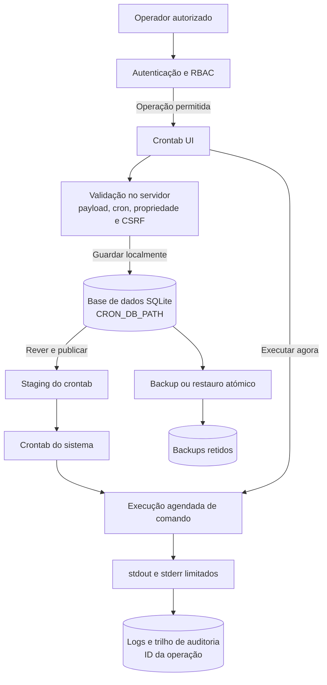

# Crontab UI

## Carregar ficheiros de ambiente locais

O comando `npm start` não carrega deliberadamente um ficheiro de ambiente, evitando que o desenvolvimento local utilize por engano credenciais ou definições de transporte de produção.

Use `npm run start:env` para `.env` ou `npm run start:production` para `.env.production`. O comando `start:env` exige que `.env` exista.

[English](README.md) | [Português (Portugal)](README.pt-PT.md)

<p align="center"></p>

Gestão web de tarefas cron com controlo de acesso, cópias de segurança, auditoria e limites de execução.

> A execução de uma tarefa é equivalente a executar o respetivo comando com os privilégios do processo do serviço. Instale a aplicação apenas em ambientes onde os administradores autorizados possam criar e publicar esses comandos.

## Novidades deste fork

Este fork estende a interface visual original de gestão de crontab com controlos operacionais orientados a produção:

- Controlo de acesso por papéis (RBAC), propriedade das tarefas e permissões impostas pelo servidor para operações administrativas.
- Validação rigorosa de payloads de tarefas, expressões cron, variáveis de ambiente, importações e pedidos de recuperação.
- Perfis SMTP exclusivos do servidor: os registos das tarefas guardam apenas `profileId` e política de envio, nunca credenciais de correio.
- Fluxos atómicos e protegidos por bloqueio para importação, restauro e backups, com retenção por quantidade e idade.
- Execução de comandos limitada por timeout e output, tratamento de terminação, auditoria estruturada, IDs de correlação e rotação de logs.
- Estado persistente das execuções manuais, com uma execução simultânea por actor e interrupção controlada no encerramento do serviço.
- Salvaguardas para deployment em produção, incluindo autenticação obrigatória fora de loopback, proteção CSRF, imposição de TLS ou proxy de confiança e orientação para Docker endurecido.

## Interface

### Lista de tarefas


### Criar uma tarefa


## Fluxo operacional



As tarefas são guardadas primeiro localmente. Só afetam o agendador do sistema depois de um operador autorizado as rever e publicar explicitamente.

## Origem canónica e versões

A origem canónica deste fork é [Kowts/crontab-ui](https://github.com/Kowts/crontab-ui). O remoto não tem, neste momento, tags publicadas: não substitua `<release-tag>` por uma versão assumida apenas a partir de `package.json`. Para produção, aprove um commit depois da validação, crie uma tag anotada e publique a release; o ramo `main` destina-se a desenvolvimento e validação contínua.

Não use `npm install -g crontab-ui` como instrução de instalação deste fork: esse nome pode resolver para outro pacote e não garante a presença dos controlos documentados aqui.

### Referência do projeto original

O [README original do projeto de origem](README/README.ORIGINAL.md) é mantido apenas para comparação histórica. Contém instruções de instalação e deployment desatualizadas que não incluem os controlos de segurança deste fork; utilize antes este README e os guias operacionais deste repositório.

## Requisitos e limites da plataforma

- Node.js 20 ou superior;
- Linux/Unix com o binário `crontab` disponível para importar ou publicar no crontab do sistema;
- permissões de escrita apenas no diretório de dados e no mecanismo de agendamento gerido pelo serviço;
- para produção, TLS nativo ou reverse proxy HTTPS de confiança.

A interface e os testes podem correr em Windows, mas as operações **Get from crontab** e **Publish to crontab** dependem de `crontab` e não são suportadas nativamente nesse sistema operativo.

## Instalação a partir do repositório

Para desenvolvimento ou para preparar uma release candidata:

```bash
git clone https://github.com/Kowts/crontab-ui.git
cd crontab-ui
git checkout <commit-aprovado-ou-tag-publicada>
npm ci
npm run lint
npm test
```

Antes de iniciar, configure as variáveis no gestor de segredos/ambiente do processo. O projeto **não** carrega `.env` automaticamente. Defina sempre um `CRON_DB_PATH` persistente e com acesso exclusivo do utilizador do serviço.

```bash
export NODE_ENV=production
export HOST=127.0.0.1
export PORT=8000
export CRON_DB_PATH=/var/lib/crontab-ui
export BASIC_AUTH_USERS_JSON='{"admin":"substitua-por-um-segredo"}'
export AUTHZ_ROLE_MAP_JSON='{"admin":"admin"}'
export CSRF_SECRET='substitua-por-um-segredo-aleatorio-longo'
export TRUSTED_PROXY='127.0.0.1'
npm start
```

O exemplo pressupõe que um proxy HTTPS local termina TLS e é a única origem que acede ao serviço. Consulte [a configuração Nginx](README/nginx.md) para o cabeçalho `X-Forwarded-Proto` e o valor de `TRUSTED_PROXY`.

## Deployment com Docker Compose

O `docker-compose.yml` não publica a porta da aplicação e passa `NODE_ENV=production`, `HOST=0.0.0.0`, `BASIC_AUTH_USERS_JSON`, `AUTHZ_ROLE_MAP_JSON`, `CSRF_SECRET` e `TRUSTED_PROXY` para o contentor. A imagem é etiquetada localmente como `kowts/crontab-ui`. Declara a rede partilhada `crontab-ui-internal`, cujo nome pode ser alterado com `CRONTAB_UI_NETWORK`; o Compose do proxy deve referenciá-la como rede externa. O repositório não inclui um serviço Nginx, pelo que o proxy continua a ser gerido separadamente. Copie os valores abaixo para um ficheiro secreto, por exemplo `.env.production`, que **não** deve ser versionado:

```dotenv
# Escolha apenas este mecanismo para vários utilizadores.
BASIC_AUTH_USERS_JSON={"admin":"substitua-por-um-segredo","operator":"substitua-por-outro-segredo"}
AUTHZ_ROLE_MAP_JSON={"admin":"admin","operator":"operator"}
CSRF_SECRET=substitua-por-um-segredo-aleatorio-longo
CRONTAB_UI_NETWORK=crontab-ui-internal
# Exemplo ilustrativo: confirme a rede efetiva antes de usar este valor.
# Deve identificar a origem direta do proxy que encaminha para o contentor.
TRUSTED_PROXY=172.20.0.0/16
```

Valide os valores sem os expor no terminal e inicie:

```bash
docker compose --env-file .env.production up -d --build
docker compose ps
```

Para desenvolvimento local, a sobreposição publica a porta apenas em loopback. Este modo não substitui um teste de integração com o proxy de produção:

```bash
docker compose --env-file .env.production -f docker-compose.yml -f docker-compose.dev.yml up --build
```

Não monte o diretório de crontab do anfitrião no contentor. Use exclusivamente o volume gerido `crontab-data`; montar o crontab do anfitrião concede à aplicação controlo sobre o agendamento do anfitrião e elimina o isolamento do contentor.

A imagem executa o processo web, o agendador do contentor e as tarefas agendadas com o utilizador não privilegiado `node`. O agendador específico do contentor é o Supercronic, que vigia o ficheiro de crontab preparado e recarrega-o após a publicação. O Supervisor permanece como PID 1 apenas para gerir esses processos. Depois de atualizar a imagem, valide a identidade efetiva com uma tarefa descartável como `id > /crontab-ui/crontabs/logs/scheduled-identity.txt`, publique-a, aguarde pelo horário e execute:

```bash
docker compose --env-file .env.production exec crontab-ui sh -c 'ps -o user,pid,ppid,args; cat /crontab-ui/crontabs/logs/scheduled-identity.txt'
```

O output da tarefa agendada deve conter `uid=1000(node)` (ou o UID atribuído a `node` na imagem). Um endpoint HTTP saudável não comprova isolamento de privilégios do agendador.

O Compose remove todas as capacidades Linux e readiciona apenas `SETUID` e `SETGID`, para que o Supervisor possa iniciar os seus comandos fixos de web e agendador como `node`. Essas capacidades não são retidas pelos processos filhos nem disponibilizadas às tarefas agendadas.

## Autenticação e autorização

Quando `HOST` não é loopback, a autenticação é obrigatória. Estão disponíveis duas alternativas:

- `BASIC_AUTH_USER` e `BASIC_AUTH_PWD`, para um único utilizador;
- `BASIC_AUTH_USERS_JSON`, para um mapa de vários utilizadores.

Se ambas estiverem definidas, `BASIC_AUTH_USERS_JSON` prevalece e o par individual é ignorado. A interface web usa uma sessão assinada e `HttpOnly`, pelo que o utilizador pode terminar sessão através da barra de navegação. Em instalações com autenticação, todos os utilizadores têm de constar em `AUTHZ_ROLE_MAP_JSON`. `AUTH_SESSION_SECRET` é opcional; se estiver ausente, `CSRF_SECRET` assina o cookie de sessão. Defina um `AUTH_SESSION_SECRET` dedicado para rodar a assinatura de sessão de forma independente. As sessões são stateless: terminar sessão remove o cookie do navegador, mas não consegue revogar individualmente uma cópia desse cookie antes de expirar. Uma lista de revogação no servidor é um reforço futuro.

| Papel | Capacidades |
| --- | --- |
| `viewer` | Consulta as próprias tarefas e respetivos registos. A pré-visualização global do crontab, exportação da base de dados, backups, restauro e ambiente são exclusivos de `admin`. |
| `executor` | Capacidades de consulta e execução de tarefas próprias. |
| `operator` | Capacidades de consulta por predefinição. A criação, alteração, pausa, ativação, remoção e execução das próprias tarefas requerem `ALLOW_OPERATOR_TASK_EXECUTION=true` explícito. |
| `admin` | Acesso global, ambiente, importação/exportação, cópias de segurança, restauro e importação do crontab do sistema. |

Cada tarefa criada recebe `owner` e `createdBy`. As tarefas antigas e as tarefas importadas do sistema não têm proprietário e ficam reservadas a administradores até serem recriadas ou atribuídas por um procedimento administrativo. A interface mostra proprietário, capacidades efetivas e se uma tarefa está apenas local ou publicada; o servidor continua a impor as permissões em todos os endpoints.

## Configuração de referência

`.env.example` é um modelo de nomes e formatos, não um ficheiro carregado pela aplicação. Mantenha segredos no cofre de segredos ou no ambiente do deployment.

| Variável | Finalidade e valor predefinido |
| --- | --- |
| `NODE_ENV` | Use `production` no deployment; ativa cookies seguros e exige TLS/proxy de confiança. |
| `HOST`, `PORT`, `BASE_URL` | Escuta HTTP e prefixo público. Predefinições: `127.0.0.1`, `8000`, sem prefixo. |
| `CRON_DB_PATH` | Diretório persistente para a base SQLite (`crontab.db`), backups, ambiente, auditoria e output de execução. Predefinição: `./crontabs`. |
| `CRON_PATH` | Diretório de staging do crontab. Deve ser acessível apenas ao processo da aplicação e ao mecanismo de agendamento isolado. Predefinição: `$CRON_DB_PATH/crontab-staging`. |
| `CRON_USER` | Conta do agendador quando `CRON_IN_DOCKER` está ativo. A imagem fixa-a em `node`; não a defina como `root`. |
| `SCHEDULER_RELOAD_TIMEOUT_MS` | Tempo máximo de espera para o Supercronic validar e confirmar a recarga de uma agenda Docker publicada. Predefinição: `10000`. |
| `BASIC_AUTH_USER`, `BASIC_AUTH_PWD` | Autenticação de utilizador único; alternativa ao mapa JSON. |
| `BASIC_AUTH_USERS_JSON` | Mapa JSON de utilizadores e palavras-passe; tem precedência sobre o par individual. |
| `AUTHZ_ROLE_MAP_JSON` | Mapa JSON de utilizador para `viewer`, `executor`, `operator` ou `admin`. |
| `CSRF_SECRET` | Segredo persistente obrigatório em produção. |
| `AUTH_SESSION_SECRET` | Segredo persistente opcional para assinar sessões; por omissão usa `CSRF_SECRET`. |
| `AUTH_SESSION_TTL_MS` | Duração da sessão em milissegundos; por omissão 8 horas (mínimo 1 minuto, máximo 7 dias). |
| `LOGIN_RATE_LIMIT_MAX` | Tentativas falhadas de `POST /login` permitidas por IP de origem na janela configurada; por omissão 10. Os inícios de sessão bem-sucedidos não contam. |
| `LOGIN_RATE_LIMIT_WINDOW_MS` | Janela de tentativas de login em milissegundos; por omissão 15 minutos (mínimo 1 minuto, máximo 24 horas). |
| `SSL_CERT`, `SSL_KEY` | TLS nativo; devem ser definidos em conjunto. |
| `TRUSTED_PROXY` | Endereço, CIDR ou alias Express do proxy HTTPS de confiança. |
| `CRONTAB_UI_NETWORK` | Nome da rede Docker partilhada com o proxy. Predefinição Compose: `crontab-ui-internal`. |
| `MAIL_PROFILES_JSON` | Perfis SMTP/SMTPS exclusivos do servidor. As tarefas guardam apenas `profileId` e a política de envio. |
| `MAIL_MAX_ATTACHMENT_BYTES` | Limite por anexo de output de correio. Predefinição: `524288`. |
| `COMMAND_TIMEOUT_MS`, `COMMAND_MAX_BUFFER`, `COMMAND_KILL_GRACE_MS` | Limites de execução de tarefas e publicação. Predefinições: `300000`, `1048576`, `5000`. |
| `LOG_MAX_BYTES`, `LOG_ROTATION_COUNT`, `LOG_RETENTION_DAYS` | Tamanho, rotação e retenção de logs. Predefinições: `10485760`, `5`, `30`. |
| `BACKUP_RETENTION_COUNT`, `BACKUP_RETENTION_DAYS` | Número e idade máximos de backups. Predefinições: `30`, `90`. |
| `SYSTEM_CRONTAB_IMPORT_TIMEOUT_MS`, `SYSTEM_CRONTAB_IMPORT_MAX_BUFFER` | Limites da leitura `crontab -l`. Predefinições: `30000`, `262144`. |
| `TASK_ENV_ALLOWLIST` | Variáveis geridas pela interface, revistas e separadas por vírgulas, passadas aos processos de tarefas. Predefinição: `PATH,LANG,LC_ALL,TZ,MAILTO`. Segredos do serviço e variáveis inseguras de carregamento são sempre recusados. |
| `ALLOW_OPERATOR_TASK_EXECUTION` | Permite aos operadores criar, alterar e executar comandos arbitrários. Predefinição: `false`. Defina apenas após aceitar que um operador é um papel altamente privilegiado sem isolamento de processo/sistema de ficheiros. |
| `ENABLE_AUTOSAVE` | Ativa publicação automática após alterações; só use quando o risco operacional tiver sido aceite. |

`CRON_IN_DOCKER` é uma variável interna da imagem Docker, não uma configuração de deployment público. `ALLOW_INSECURE_NO_AUTH` não é suportada em produção.

## Segurança do correio, ambiente e comandos

Os perfis de correio são definidos em `MAIL_PROFILES_JSON` e aceitam apenas `transporter` SMTP/SMTPS, `from` e um a vinte destinatários `to`. O formulário de tarefas lista apenas IDs de perfis validados e guarda somente o `profileId` e a política de envio; credenciais, remetentes e destinatários não entram na base de dados, nas tarefas nem no browser. A predefinição é `onFailure`; `onSuccess` e `always` ficam disponíveis quando necessários. O assunto identifica o resultado, a duração e o código de saída. Um output demasiado grande nunca faz falhar o alerta: um ficheiro acima de `MAIL_MAX_ATTACHMENT_BYTES` é anexado truncado aos primeiros bytes com um aviso explícito, um ficheiro ilegível ou em falta é omitido, e o corpo orienta o destinatário para os registos completos de execução na aplicação. Falhas de transporte, envios ignorados pela política e anexos degradados são auditados; monitorize o diário de operações. Cada resultado de entrega tem um único registo de auditoria: o processo mailer regista o seu próprio resultado, incluindo uma falha inesperada, e o processo pai regista apenas a falha que pode observar por si, ou seja, o processo não arrancar.

Todos os perfis são validados no arranque do serviço, pelo que uma configuração que não pode entregar bloqueia a instalação em vez de falhar mais tarde, na primeira tarefa que a utilize. Todos os perfis inválidos são reportados de uma vez, cada um identificado. Os administradores podem também usar **Acções → Testar perfil de correio**, que envia uma mensagem real para os destinatários já definidos no perfil. O pedido aceita apenas um identificador de perfil: destinatários, remetente e credenciais permanecem no servidor, o browser nunca os recebe, e as falhas de transporte são reportadas como uma categoria (credenciais rejeitadas, TLS, DNS, recusada, tempo esgotado, mensagem rejeitada) em vez do erro SMTP em bruto, que pode citar o utilizador ou o nome do servidor. O detalhe completo do servidor fica no diário de operações. O teste é limitado por perfil para não poder ser usado para inundar os destinatários configurados.

As variáveis de ambiente introduzidas na interface aceitam apenas linhas `NOME=valor`, com nomes que respeitem `^[A-Z_][A-Z0-9_]*$`. Sintaxe de shell (`export`, `$()`, backticks, pipes, redirecionamentos e `;`) é rejeitada. Os processos das tarefas recebem um ambiente novo, não `process.env`: apenas nomes revistos em `TASK_ENV_ALLOWLIST` são transmitidos. As variáveis de autenticação, CSRF, SMTP, carregamento Node e carregamento dinâmico nunca são passadas aos comandos. Isto não transforma comandos de tarefas em seguros: esses comandos continuam a ser uma capacidade privilegiada e devem ser revistos antes de serem criados.

Cada execução manual ou agendada tem timeout, limite conjunto de output e encerramento SIGTERM/SIGKILL. A importação e publicação do crontab usam execução sem shell; a importação é limitada, deduplicada, protegida por bloqueio e só responde depois de terminar. Em Linux, o executor termina o grupo de processos; em Windows a terminação completa da árvore depende do sistema operativo.

## Backups, recuperação e auditoria

Antes de importar uma base ou restaurar um backup, a aplicação cria uma cópia de segurança e valida o candidato. A importação de bases usa por defeito **Combinar**: as tarefas existentes são mantidas, os duplicados exatos são ignorados e as tarefas com o mesmo nome mas conteúdo diferente são assinaladas como conflitos sem serem substituídas. O diálogo de revisão apresenta as contagens antes de qualquer escrita. **Substituir todas as tarefas existentes** está disponível apenas como modo explícito de importação e é destrutivo após o backup automático. Os backups reconhecidos seguem a retenção por quantidade e idade; falhas de retenção são auditadas.

No primeiro arranque, uma `crontab.db` NeDB legada é migrada automaticamente para SQLite. O ficheiro original é retido ao lado da nova base como `crontab.db.legacy-nedb-<timestamp>`; preserve-o até confirmar as tarefas migradas e um restauro de recuperação, removendo-o depois através do processo normal de gestão de alterações.

Procedimento de recuperação:

1. Suspenda o acesso público no proxy, preservando o volume `crontab-data` e `crontabs/logs/operations.jsonl`.
2. Identifique o `operationId` mostrado na interface ou no cabeçalho `X-Request-ID` e preserve o contexto da falha.
3. Numa instância isolada, valide a cópia exportada ou o backup candidato.
4. Use apenas a área administrativa **Backups** para restaurar um backup reconhecido.
5. Confirme as tarefas, ambiente e pré-visualização antes de publicar novamente no crontab.

Não execute o serviço como `root` para contornar permissões e não use `--reset` como recuperação de rotina: ambos podem invalidar a separação de privilégios ou apagar a configuração ativa. Corrija permissões do volume e restaure um backup validado.

O diário `operations.jsonl` contém eventos estruturados com actor, papel, resultado, duração e IDs de correlação. Comandos são registados por hash SHA-256. Exporte o diário para retenção central com acesso restrito e teste restauros regularmente numa instância não produtiva.

Hooks arbitrários não são suportados. Para pós-processamento, use uma tarefa explícita, revista e auditável.

## Checklist de lançamento

1. Fixe uma release/tag de `Kowts/crontab-ui` e execute `npm ci`.
2. Configure autenticação, RBAC, `CSRF_SECRET`, `CRON_DB_PATH` persistente e TLS nativo ou `TRUSTED_PROXY`.
3. Execute `npm run lint`, `npm test`, `npm run test:coverage` e `npm audit --omit=dev --audit-level=high`.
4. Execute um restauro de teste numa instância isolada e confirme a retenção de backups e logs.
5. Faça build e execução reais da imagem Docker na plataforma alvo, verificando a execução do agendador como `node` e o volume persistente.
6. Execute `npm run test:docker-scheduler` num runner com Docker; publica uma tarefa pela aplicação, verifica a confirmação de recarga do Supercronic e comprova que a tarefa agendada corre como `node`.

## Recursos

- [Configuração de Nginx e TLS](README/nginx.md)
- [Diagnóstico e recuperação](README/issues.md)
- [Licença MIT](LICENSE.md)
